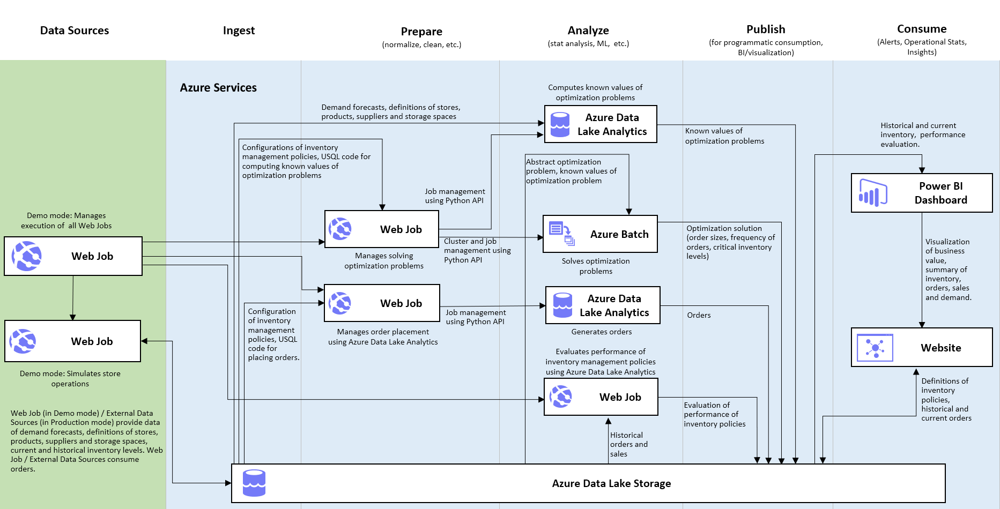
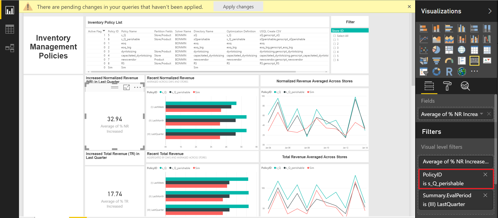
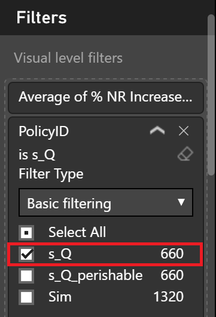
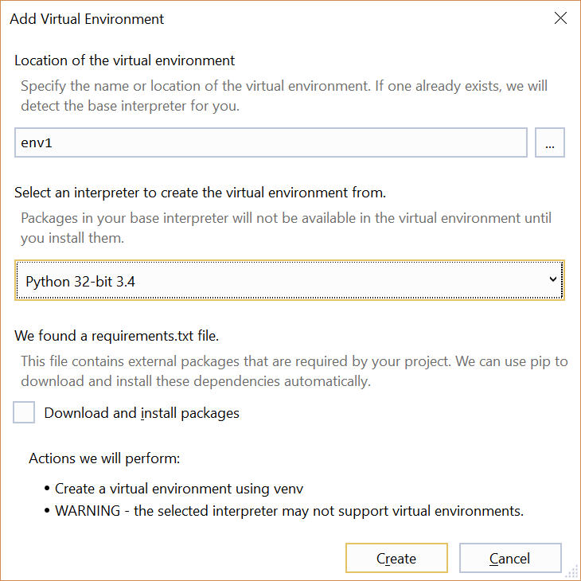

# Inventory Optimization Solution
## Table of Contents
- [Abstract](#abstract)  
- [Prerequisites](#prerequisites)
- [Architecture](#architecture)
- [Setup Steps](#setup-steps)
- [Validation and Results](#validation-and-results)
- [Inventory Optimization Website](#inventory-optimization-website)
- [Delete the Solution](#delete-the-solution)

## Abstract
This **Manual Deployment Guide** provides step-by-step instructions for deploying the **Inventory Optimization Solution**. Going through this manual deployment process will help implementers gain an inside view of how the solution is built, the function of each component,and how all elements work together. The estimated deployment time of this solution is 4~6 hours, depending on your experience with Azure and whether you deploy the optional components. 

## Prerequisites
You will need the following accounts and software to create this solution:

- Source code and instructions from this GitHub repo (Download/Clone)

- A [Microsoft Azure subscription](<https://azure.microsoft.com/>) 

- A Microsoft Office 365 subscription for Power BI access

- [Power BI Desktop](<https://powerbi.microsoft.com/en-us/desktop>)

- A network connection

## Architecture



The figure above shows the overall architecture of the Inventory Optimization Solution. Below is a brief introduction of each component. 
- **Data Source**: The data in this solution is generated using a data simulator, including demand forecasting, inventory level, and sales data.
- **Ingest and Prepare**: The raw data is first converted to Pyomo input format using Azure Data Lake Analytics (ADLA) U-SQL jobs. Then Pyomo converts the input into standard optimization problem formats, .nl or .mps. 
- **Analyze**: The optimization computation is done on Azure Batch in parallel. The optimization problems are solved by [BONMIN](https://projects.coin-or.org/Bonmin), an open-source C++ code for solving general Mixed Integer NonLinear Programming problems. 
- **Post-processing and Publish**: The results of solving optimization problems are converted to order time and order amount by ADLA U-SQL jobs.
- **Visualize**: A PowerBI Dashboard is used to visualize inventory policy performance and inventory level. 
- **Web Job Schedules**: A **Main** Web Job is scheduled to run once every 6 hours. This Web Job invokes the other web jobs that are executed according to the schedule configuration of each policy in Configuration.xlsx 

## Setup Steps
This section walks the readers through the creation of each of the Azure resources in the architecture defined in Figure 1.

As there are usually many interdependent components in a solution, Azure Resource Manager enables you to group all Azure services in one solution into a [resource group](https://azure.microsoft.com/en-us/documentation/articles/resource-group-overview/#resource-groups). Each component in the resource group is called a resource.

Similarly, we want to use a common name for the different resources we are creating. The remainder of this document will use the assumption that the base service name is: inventoryopt[UI][N]

Where [UI] is the user initials and N is a random integer that you choose. Characters must be entered in lowercase. Several services, such as Azure Storage, require a unique name for the storage account across a region and hence this format should provide the user with a unique identifier. So for example, Steven X. Smith might use a base service name of *inventoryoptsxs01.*  

>**NOTE:** In this deployment guide, we create most resources in the  Central US region. The resource availability, e.g. Azure Batch account quotas, in different regions depends on your subscription. Please choose a region that satisfies the following requirement

- At least one Azure Batch account is available. By default, you can create one batch account per region per subscription. To check the number of available Batch accounts in your subscription 
  - Navigate to ***portal.azure.com*** and log in to your account
  - Click **All resources** on the left. 
  - In the filters at the top, select the subscription you want to use to deploy this solution and select **Batch accounts** for the resource type. You will see how many Batch accounts have been created in each region. Delete any Batch account no longer needed or deploy this solution in a region where no Batch account has been created.
  - You can also submit a request to increase you quota by selecting **Help + support** on the left side of the portal page. 

>For more details about Azure Batch quotas and how to increase the quotas, please see [this documentation](https://docs.microsoft.com/en-us/azure/batch/batch-quota-limit). When deploying resources, make sure all data storage and compute resources are created in the same region to avoid inter-region data movement.

In the setup steps below, the following Azure resources will be created and configured under your subscription: Azure Resource Group, Azure Storage Account, Azure Batch Account, Azure Active Directory Service Principle, Azure Data Lake Store, Azure Data Lake Analytics, and Azure Web App.

### 1. Create a new Azure Resource Group

  - Navigate to ***portal.azure.com*** and log in to your account

  - On the left tab click ***Resource Groups***
  
  - In the resource groups page that appears, click ***Add***
  
  - Provide a name ***inventoryopt\[UI\]\[N\]_resourcegroup***
  
  - Select a ***location***. Note that resource group is a virtual group that groups all the resources in one solution. The resources don’t have to be in the same location as the resource group itself.
  
  - Click ***Create***

### 2. Set up Azure Storage Account

  - Navigate to ***portal.azure.com*** and log in to your account

  - On the left tab click **+ (New) > Storage > Storage Account**

  - Set the name to ***inventoryopt\[UI\]\[N\]***

  - Set the resource group to the resource group we created by selecting the radio button ***Use existing***

  -  Location set to Central US
  > **NOTE:** This storage account will be used as the associated storage account of the Azure Batch Account which will be created in later steps. Because it is required that the Azure Batch Account and its associated storage account must be located at the same Azure location, you should set the location of the storage account to one of the locations where your subscription has enough quotas for creating Azure Batch pools.
	
  - Click ***Create***


### 3. Set up Azure Batch Account
  
  - Navigate to ***portal.azure.com*** and log in to your account

  - On the left tab click **+ (New) > Compute > Batch Service**

  - Set the name to ***inventoryopt\[UI\]\[N\]***

  - Set the resource group to ***inventoryopt[UI][N]\_resourcegroup*** which we created, by selecting the radio button ***Use existing***
  
  - Click on **Storage account** and select the storage account ***inventoryopt[UI][N]*** created in Step 2. 

  -  Location set to  Central US

  -  Leave **Pool allocation mode** as **Batch Service**

### 4. Create Azure Active Directory (AAD) Service Principle

  - Navigate to ***portal.azure.com*** and log in to your account

  - In the list of services on the left side of the website, click **Azure Active Directory** > **App registrations**
  - On the top of the new blade, click **+ New application registration**
  - Set the name to ***inventoryopt[UI][N]***
  - Leave the **Application type** as **Web app / API**
  - Set the **Sign-on URL** to ***http://www.inventoryopt[UI][N].com***
  - Click **Create** at the bottom

### 5. Create Azure Data Lake Store

- Navigate to ***portal.azure.com***

- Click **+(New) > Storage > Data Lake Store** 

- Set the name to ***inventoryopt[UI][N]***
- Set the resource group to ***inventoryopt[UI][N]\_resourcegroup*** which we created, by selecting the radio button ***Use existing***
- Set Location to  Central US 
- Click **Create** at the bottom left corner of the blade

### 6. Create Azure Data Lake Analytics Account
- Navigate to ***portal.azure.com***

- Click **+(New) > Data + Analytics > Data Lake Analytics**. 

- Set the name to ***inventoryopt[UI][N]***
- Set the resource group to the **inventoryopt[UI][N]\_resourcegroup**, by selecting the radio button ***Use existing***
- Set Location to  Central US
- Click on **Data Lake Store**, from the list of Data Lake Stores, select the Data Lake Store created in Step 5.  
- Click **Create** in the bottom left corner of the blade

- Wait for the Azure Data Lake Analytics Account to be created

**Install U-SQL Advanced Analytics Extensions on Azure Data Lake Analytics. These extensions allow you to run Python scripts embedded in U-SQL scripts.**
  - Navigate to ***portal.azure.com***

  - On the left tab click Resource Groups

  - Click on the resource group we created earlier ***inventoryopt\[UI\]\[N\]_resourcegroup***. If you don’t see the resource group, click ***Refresh*** 

  - Click on the Data Lake Analytics Account in Resources
  
  - Click on **Sample Scripts**
  
  - In the new blade, click on **U-SQL Advanced Analytics Extensions available**
  - Wait for 1~2 minutes and you should see a **Success** message. A job has been submitted to install the extensions and click on the **Success** message to monitor the job progress

  - Wait for the installation job to complete, which should take 2~5 minutes

### 7. Create Azure Web App Service
- Navigate to ***portal.azure.com***

- Click **+(New) > Web + Mobile > Web App**
- Set the name to ***inventoryopt[UI][N]***
- Set the resource group to ***inventoryopt[UI][N]\_resourcegroup***, by selecting the radio button ***Use existing***
- Click **App Service plan/Location > Create New**
  - Set the name to ***inventoryopt[UI][N]***
  - Set hte location to  Central US
  - Choose your preferred pricing tier
  - Click **OK** at the bottom
  - Wait for the App Service Plan to be created

- Return to the Web App blade and click **Create** at the bottom
- Wait for the Web App to be created

**Install Python 3.5 extension on the Web App. The Web App we just created has Python 2.7 and Python 3.4 by default. For this solution, we need Python 3.5 which can be installed on the Web App as an extension.**
- Navigate to ***portal.azure.com***
- On the left tab click Resource Groups
- Click on the resource group we created earlier ***inventoryopt\[UI\]\[N\]_resourcegroup***
- Click the App Service in the list of resources. 
- Under App Service, search for "Extensions" and click "Extensions"
- In the new blade, click **+Add** at the top
- From the extension list, select **Python 3.5.2 x64**
- Read and accept the Legal Terms by click **OK** at the bottom of the **Accept legal terms** blade
- Click **OK** at the bottom of the **Add extension** blade

**Enable Always-on on the Web App** This is required to run scheduled web jobs. 
- Under App Service, select **Application settings**
- Switch **Always On** from **Off** to **On**
- Click **Save** at the top

### 8. Configure Web App Service
In this step, we will collect the credentials of each resource and enter them as **Application settings** of the Web App, so that they can be read by the web jobs (created in the next step) as web app environmental variables. We will also set some other configurations, e.g. number of virtual machines(VM) in the Azure Batch pool, VM configurations.
To enter an environmental variable on the Web App
- Under the App Service blade, select **Application settings**
- Scroll down to the **App settings** section.
- Next, we provide a list of **Key** names and instructions for how to obtain the **Value** corresponding to each **Key**
>**Note**: As you enter (Key,Value) pairs, click **Save** for every few pairs so that you don't lose your changes in case you leave the page accidentally. If you are copying values from this document, make sure you don't copy any extra character, e.g. spaces, before or after the value. Please replace [UI][N] with your own user initial and number you've been using to create resources. 

- Navigate to ***portal.azure.com*** and log in to your account, preferrably on a separate screen, so that you can collect credentials on one screen and enter them as application settings on another screen.
- On the left tab click **Resource Groups**
- Click on the resource group we created earlier ***inventoryopt\[UI\]\[N\]_resourcegroup*** 

**Blob Storage**

Click on the **Storage account** ***inventoryopt[UI][N]*** in the resource list. Add the following Key:Value pairs to the application settings of your Web App Service.
- STORAGE_ACCT: inventoryopt[UI][N]
- STORAGE_KEY: 
  - Under the **Storage account** blade,click on ***Access Keys***. 
  - Copy **key1** and enter it as the **Value** of the STORAGE_KEY **Key** in the Web App settings. 
- STORAGE_ENDPOINT: core.windows.net

**Batch Account**

Return to the resource group resource list, click on the **Batch account** ***inventoryopt[UI][N]*** . Add the following Key:Value pairs to the application settings of your Web App Service.
- BATCH_ACCT_NAME: inventoryopt[UI][N]
- BATCH_ACCT_URL: In the **Overview** blade of the **Batch account**, copy the **URL** ending in ***batch.azure.com*** and enter it as the **Value** for the BATCH_ACCT_URL **Key** in the Web App settings. 

**Azure Data Lake**

Add the following Key:Value pairs to the application settings of your Web App Service.
- DATALAKESTORE_NAME: inventoryopt[UI][N]
- ADLA_AU_PER_USQL_JOB: 50

**Web App**

Return to the resource group resource list, click on the **App Service** ***inventoryopt[UI][N]*** . Add the following Key:Value pairs to the application settings of your Web App Service.
- FUNCTIONS_APP_NAME: inventoryopt[UI][N]
- FUNCTIONS_APP_USER: 
  - In the **Overview** blade of the App Service, click **Get publish profile**, download and save the file ***inventoryopt[UI][N].PublishSettings***. 
  - Open the PublishSettings file and search for **userName**. Copy the value without the quotes and enter it as the **Value** of  the FUNCTIONS_APP_USER **Key** in the Web App settings. 
- FUNCTIONS_APP_PASSWORD:
  - In the PublishSettings file, search for **userPWD**. Copy the value without the quotes and enter it as the **Value** of the FUNCTIONS_APP_PASSWORD **KEY** in the Web App settings. 
  - Permanently delete the PublishSettings file from your computer. 

**Docker Image**

Add the following Key:Value pair to the application settings of your Web App Service.
- DOCKER_REGISTRY_IMAGE: hlums/inventoryoptimization:latest

**Batch Pool Configurations**

Add the following Key:Value pairs to the application settings of your Web App Service.
- BATCH_MAX_TASK_PER_NODE: 4
- BATCH_START_NODE_COUNT : 5
- BATCH_VM_SIZE: STANDARD_D3
- BATCH_NODE_OS_PUBLISHER: Canonical 
- BATCH_NODE_OS_OFFER: UbuntuServer
- BATCH_NODE_OS_SKU: 16.04-LTS

**AAD Service Principle**

Close all blades and click on **Azure Active Directory** on the left side of the portal. Add the following Key:Value pairs to the application settings of your Web App Service.
- TENANT_ID: Under the **Azure Active Directory** blade, click on **Properties**. Copy the **Directory ID** and enter it as the **Value** of the TENANT_ID **Key** in the Web App settings. 
- CLIENT_ID:
  - Under the **Azure Active Directory** blade, click on **App registrations** blade and search for ***inventoryopt[UI][N]*** and select it
  - Copy the **Application ID** and enter it as the **Value** of the CLIENT_ID **Key** in the Web App settings. 

- CLIENT_SECRET:
  - Under **Settings**, click on **Keys**
  - In the **Keys** blade, enter ***invoptkey*** in the **Key description** box
  - Select a desired **Duration** you want the key to expire.
  - Click **Save** at the top.
  - Copy the key **Value** and enter it as the **Value** of the CLIENT_SECRET **Key** in the Web App settings

**Other settings**

Add the following Key:Value pairs to the application settings of your Web App Service.
- SUBSCRIPTION_ID:
  - Close all blades and click on **Subscriptions** on the left side of the portal.
  - Click on the subscription used to create the resources. 
  - Copy the **Subscription ID** and enter it as the **Value** of the SUBSCRIPTION_ID **Key** in the Web App settings.
- RESOURCE_GROUP: inventoryopt[UI][N]_resourcegroup
- SCM_COMMAND_IDLE_TIMEOUT: 10800
- WEBJOBS_IDLE_TIMEOUT: 10800

### 9. Authenticate service principle to access resources
**Grant Resource Group access permission to the Service Principal created in Step 4**. This will allow Azure Batch Shipyard access the resources in the resource group using the service principle, including the batch account. This will also allow the Python scripts submit U-SQL jobs to Azure Data Lake Analytics using the service principle.
- Navigate to ***portal.azure.com***
- On the left tab click Resource Groups
- Click on the resource group we created earlier ***inventoryopt\[UI\]\[N\]_resourcegroup***
- Click on **Access control(IAM)** and click **+Add** at the top
- Under **Role**, select **Contributor**
- Search for the name of the service principle, ***inventoryopt[UI][N]*** , created in Step 4. Select it and click **Save** at the bottom. 

**Grant Azure Data Lake Store access permission to the Service Principal created in Step 4**. This will allow the Python scripts uploading and downloading files to/from Azure Data Lake Store using the service principle. 
- Close the **Access control(IAM)** blade and return to the **Overview** blade
- In the resource list, click on the Data Lake Store.
- Click on **Data Explorer** > **Access** > **+Add** at the top
- Under **Select User or Group**, search for the Service Principal ***inventoryopt[UI][N]***  and select it.
-  Under **Select Permissions** select the following options, and click **OK** at the bottom after the selection.
    - **Permissions** : Check Read, Write, and Execute
    - **Add to**: This folder and all children
    - **Add as**: An access permission entry and a default permission entry
- DON'T close the **Access** blade until you see a green check message "Successfully assigned permissions to inventoryopt[UI][N]"
- If you need more clarification on this section, follow the instructions [here](https://docs.microsoft.com/en-us/azure/data-lake-store/data-lake-store-secure-data#a-namefilepermissionsaassign-users-or-security-group-as-acls-to-the-azure-data-lake-store-file-system).

### 10. Create and run the web jobs
In this step we will add scripts of 8 web jobs to the Web App we created in Step 7. Under ***Manual Deployment Guide/Scripts/webjobs***, you will find 8 folders and 8 zip files. The folders contain the source code of each web job. The zip files are created from the folders for your convenience. 

**Create and run InstallPackages web job**

1) Navigate to ***portal.azure.com***

2) On the left tab click **Resource Groups**
3) Click on the resource group we created earlier ***inventoryopt\[UI\]\[N\]_resourcegroup***
4) Click the App Service in the list of resources. 
5) Under the **App Service** blade, select **Webjobs**
6) Click **+Add** at the top of the **WebJobs** balde
7) Enter ***InstallPackages*** as the **Name**
8) Under **File Upload**, click the folder icon on the right, browse and upload ***InstallPackages.zip*** from your computer. 
9) Select ***Triggered*** as the **Type**
10) Select ***Manual*** as the **Triggers**
11) Click **OK** at the bottom of the **Add WebJob** blade.
12) Wait until you see a notification saying "WebJob has been added" in the portal.
13) Return to the **WebJobs** blade, click **Refresh** at the top until you see the ***InstallPackages*** web job. 
14) Select the web job ***InstallPackages*** and click **Run** at the top.
15) While the web job is running, click the **Logs** button at the top and then click on the latest run to check the running log. The log  page refreshes periodically and you can also manually refresh it.
16) Wait until a green **Success** message shows up in the log page.It should take about 5 minutes for this web job to complete.
17) Check the log and make sure there is no errors as some errors don't trigger a failure of the web job.

**Create and run UploadScriptToADLS and UploadStaticDataTOADLS web jobs** The **UploadScriptToADLS** web job uploads U-SQL and Python scripts for data pre-processing, optimization, and result post-processing to Azure Data Lake store. The **UploadStaticDataTOADLS** pre-populates Azure Data Lake Store with two weeks of data and results. 

Repeat the same steps as the ***InstallPackages*** web job for the following web job names and zip files.
| **Web Job Name** |**zip file name**               |**Estimated running time**|
|------------------------|--------------------------|--------------------------|
| UploadScriptToADLS     |UploadScriptToADLS.zip    |3-5 minutes|
| UploadStaticDataToADLS |UploadStaticDataToADLS.zip|30 minutes|

**Create Simulator, InventoryOptimization, GenerateOrder, and Evaluation web jobs**

Follow steps 1~13 in creating the ***InstallPackages*** web job for the following web job names and zip files. You DON'T need to manually run these web jobs, as they will be invoked by the ***Main*** web job to be created later.

| **Web Job Name** |**zip file name**              |**Estimated running time**|
|------------------------|-------------------------|--------------------------|
| Simulator              |Simulator.zip            |6-7 minutes|
| InventoryOptimization  |InventoryOptimization.zip|Less than 30 seconds or 2 hours. When no optimization task is scheduled to run, <30 seconds. When there are optimization tasks scheduled to run, about 2 hours.|
| GenerateOrder          |GenerateOrder.zip        |15-20 minutes|
| Evaluation             |Evaluation.zip           |15-20 minutes|

**Create and schedule the Main web job**

We will create a **Main** web job that invokes the other web jobs once every 6 hours.
1) Under the **App Service** blade, select **Webjobs**
2) Click **+Add** at the top of the WebJobs balde
3) Enter ***Main*** as the **Name**
4) Under **File Upload**, click the folder icon on the right, browse and upload ***Main.zip*** from your computer. 
5) Select ***Triggered*** as the **Type**
6) Select ***Scheduled*** as the **Triggers**
7) Enter 0 0 */6 * * * as the **CRON Expression**
8) Click **OK** at the bottom of the **Add WebJob** blade.
9) Wait until you see a notification saying "WebJob has been added" in the portal.
10) Return to the **WebJobs** blade, click **Refresh** at the top until you see the ***Main*** web job.

For details of the function of each web job, please see the **Solution Overview** section in the **Technical Guide.pdf**.     

### 11. Set up PowerBI Dashboard

We have designed a Power BI dashboard to visualize the results and relevant information of the inventory optimization solution. In this step, we will explain how to set up the dashboard.

>   **Note**: The prerequisite of this step is to download and install the free software [Power BI desktop](https://powerbi.microsoft.com/desktop).

**Download the Power BI report file and sign-in**

-   Make sure you have installed the latest version of [Power BI desktop](https://powerbi.microsoft.com/desktop). If not, you may see an error message showing that it is unable to open the dashboard when you try to open the Power BI file.

-   In this GitHub repository, you can download the Power BI file of the dashboard *InventoryOptimizationSolution.pbix* under the folder [Power BI](https://github.com/Azure/cortana-intelligence-inventory-optimization/blob/master/Manual%20Deployment%20Guide/Power%20BI/) and then open it by double clicking.

-   The dashboard is prepopulated with cached data so that you could have a quick glance at the results of the solution. You might see a message saying "There are pending changes in your queries that haven't been applied." Please **DO NOT** Apply Changes since the data sources have not been updated yet.

    >   **Note**: The visualizations that you see now in your Power BI report are the cached results from a previous demo deployment, rather than the real data in your own deployment. You will see the visualizations that correspond to the data sitting under your subscription after you follow the below steps to change the data connection to your own Azure Data Lake Store.

-   Sign in by clicking **Sign in** on the top-left corner. Note: You must have a Microsoft Office 365 subscription for Power BI access.

-   Click **Edit Queries** on the top and open the query editor. You will see 5 Queries in the left panel of the query editor. You might also see an error message saying "DataFormat.Error: Invalid URI: The hostname could not be parsed.". Please ignore this error message for now and follow the instructions below to update the data sources. Once the data sources are updated, the error will be gone.

    


**Update the Azure Data Lake Store account in the Power BI file**

Next, you will need to take the following steps to update the data sources:

-   Click **StoreInfo** query and you will see that this query is highlighted in a darker color as the following screenshot shows. Then, click the **Advanced Editor** on the top, which is next to the **Refresh Preview**.

    

-   On the pop-up Advanced Editor window, replace the [ADL_NAME] in the first line with the name of the Azure Data Lake Store that you deployed in the previous steps.

    

-   Then, click **Done** on the bottom-right corner of the Advanced Editor window. You will see a warning message below

    

-   Click **Edit Credentials** in the above message and sign in the Azure Data Lake Store that you deployed by clicking **Sign in** in the pop-up window with your Azure account name and password.

-   Repeat the above steps that you have done for **StoreInfo** query (click the corresponding query, open the corresponding advanced query editor and replace the [ADL_NAME] with your data lake store name) on the other 4 queries: **InventoryPolicy** query, **InventoryLevel** query, **MetricExtended_InventoryLevel** query, and **SummaryMetric** query.

-   Click **Close & Apply** on the top-left, and you will see the visualization report in Power BI Desktop.

    

>   For details of the Power BI dashboard content, please see the **Power BI Visualization Guide** section in the **Technical Guide.pdf**.

-   [Optional] You can click **Refresh** on the top if you want to refresh the report, when there are new data coming in.

    


**Select the active policy being compared with the baseline policy**

The dashboard shows the performance metrics of two active inventory optimization policies and a baseline policy. The policy IDs of the active policies are s_Q and s_Q_perishable respectively, while the policy ID of the baseline policy is Sim. By comparing an active policy with the baseline policy, we will see the performance improvements generated by inventory optimization.

>   **Note**: In the dashboard, the improvements of s_Q_perishable policy over the baseline policy are displayed *by default*. The current step is needed if you want to change the active policy being compared with the baseline policy to s_Q.

We can choose which active policy to be compared with the baseline policy when computing the improvement ratio of each metric shown in each of the 4 cards in the Performance Evaluation part of the dashboard. For instance, you can click the card indicating the increased normalized revenue in the last quarter as follows



On the right-hand side, you can find that **PolicyID is s_Q_perishable** under the **Visual level filters** of the **Filters** panel. If you move your cursor to **PolicyID is s_Q_perishable**, you will see an arrow sign appearing. You can further click this arrow sign and choose s_Q policy instead of s_Q_perishable policy. Typically you should only choose one of the active policies. In case you select both of them, the average improvements of the s_Q and s_Q_perishable over the baseline policy will be shown.

   

**[Optional] Publish the dashboard to** [Power BI online](http://www.powerbi.com/)

>   Note that this step requires a Power BI account (or Office 365 account).

-   Click **Publish** on the top panel. Choose **My workspace** (or any other workspace where you wish to publish the dashboard) and after a little while you will see a window showing that publishing to Power BI is succeeded.

-   Click the link "Open 'InventoryOptimizationSolution.pbix' in Power BI" in the window to open the dashboard in a browser. You should see the dashboard in the browser. If not, click 'InventoryOptimizationSolution' under **REPORTS** section of **My Workspace** in the navigation panel on the left-hand side. You may need to click the arrow sign besides **My Workspace** and scroll down to find **REPORTS** section.

-   Click **Pin Live Page** on the top. On the pop-up window, choose **New Dashboard**, and put the name of the new dashboard, e.g. InventoryOptimizationSolution, and click **Pin Live**.

-   Click **InventoryOptimizationSolution** in the **DASHBOARDS** section of **My Workspace**. Click the three dots on the top-right of the dashboard tile (see the red box in the screenshot below). You may need to scroll to the right to see these three dots. Click the middle pencil icon to edit the tile details. In **Functionality**, check **Display last refresh time**, and click **Apply**. You will see the last refresh time showing up on the top-left of the dashboard.

      

-   Scroll down the bar on the right-hand side of **My Workspace** to find **InventoryOptimizationSolution** in the **DATASETS** section. Right click the dots besides **InventoryOptimizationSolution** and select **SCHEDULE REFRESH**. You might see a message "Your data source can't be refreshed because the credentials are invalid. Please update your credentials and try again." Please click *each* **Edit credentials** below this message and sign in your Office 365 account. Once this is done, you can click **Scheduled refresh** and choose **On** under **Keep your data up to date**. Then, you can specify the refresh frequency and select times for automatic data refresh by clicking **Add another time**.

    

**Collect PowerBI URL for the Inventory Optimization Website**

- On the online dashboard, click on **File** on left top of the page. 
- From the dropdown, select **Publlish to Web**
- In the popup window copy the **URL** under *Link you can send in email* and save it.
- You will be required to provide the above collected URL while setting up the inventory optimization website.

## Validation and Results

**Check Web Job logs**

In the **App Service** page, you can select a web job and click **Logs** at the top to check the logs of the web jobs.

***Main*** web job.

The ***Main*** web job will start running at the beginning of the next hour after it is created.
It invokes the other web jobs in the order of ***Simulator***, ***Evaluation***, ***InventoryOptimization***, ***GenerateOrder***. The ***Evaluation*** web job is independent of the others and the other three web jobs are dependent in the order they are invoked. The ***Main*** web job invokes the next web job after the earlier one is finished running (succeeded or failed). To check if all the web jobs run successfully, you can first check if there is any web job finished with a "Failed" status in the log of the ***Main*** web job or **Refresh** the web job status in the **Webjobs** page.
>Note that some Python script errors don't trigger a web job failure, so please check the logs of the other web jobs as well.

When checking the logs of the other web jobs, even the log page shows a green **Success**, please go over the log to make sure there are no errors that didn't trigger a web job failure.

>Note that the ***InventoryOptimization*** and ***GenerateOrder*** web jobs don't always execute computation tasks every time they are invoked. In Configurations.xlsx, we configure how frequent the ***InventoryOptimization*** and ***GenerateOrder*** web jobs execute computation tasks. By default, the ***InventoryOptimization*** web job is configured to execute computation on every Monday (every 7 hours in simulation mode) and the ***GenerateOrder*** web job is scheduled to execute computation every day (every 6 hours in simulation mode). Therefore, check logs of the ***InventoryOptimization*** jobs that run on simulated dates that are Monday. You can find the simulated dates in the web job logs.

**Check Azure Data Lake Analytics jobs**

The ***InventoryOptimization*** and ***GenerateOrder*** web jobs submit U-SQL jobs to ADLA. To check the progress of the U-SQL jobs
- Navigate to your resource group and select the **Data Lake Analytics** we created earlier.
- Click **View All Jobs**. In the list of jobs, check if there is any failure and check the progress of running jobs.

**Check output in Azure Data Lake Store**
- Navigate to your resource group and select the **Data Lake Store** we created earlier.
- Click on **Data Explorer**. Below is a summary of the ADLS data and result folders. Please see the Technical Guide.pdf for more details of ADLS directory structure. 
  - rawdata: inventory level(inv_* ), prices(pc_* ), sales(sales_*), demand forecasting(demand_forecasts folder) data generated by the ***Simulator*** web job. If you don't see any data in this folder after the first run of the ***Simulator*** web job,check the web job log.
  - optimzation: results and logs of ***InventoryOptimization*** web job. The log folder contains Azure Batch job task logs. 

    input_csv: Optimization input generated by U-SQL jobs submitted by the ***InventoryOptimization*** web job. If you don't see any data in this folder after the first run of the ***InventoryOptimization*** web job,check if there is any U-SQL job failure in ADLA. 
    
    output_csv: Optimization results generated by Azure Batch jobs submitted by the ***InventoryOptimization*** we job. If you don't see any results in this folder after the first run of the ***InventoryOptimization*** web job, check the Azure Batch logs in the log folder under the optimization directory in case of any failure with solving optimization problems. If the log folder is also empty, check the web job log. 
    
  - orders: orders generated by the baseline policy(Sim) and ***GenerateOrder*** web job for the other policies. If you don't see any data in this folder after the first run of the ***GenerateOrder*** web job, check the web job log. The metric.csv file is the performance metrics of the inventory policies visualized in the PowerBI dashboard. This file is populated by the ***Evaluation*** web job. It may take a few hours for it to get populated. 
  - webjob_log: logs of ***InventoryOptimization*** and ***GenerateOrder*** web jobs.The file LastSimulationDatetime.txt is used by the ***Main*** web job to keep track of the simulation date time. 

## Inventory Optimization Website

The purpose of this section is to guide you through the instructions to deploy the inventory optimization website. The purpose of this website is to allow Store Manages to access/review the suggested optimize inventory orders and update the optimization engine configurations

### Requirements

You will need the following accounts and software to create this solution:

-   A [Microsoft Azure subscription](https://azure.microsoft.com/)

-   A network connection

-   [Python 3.4](http://go.microsoft.com/fwlink/?linkid=516990)

-   [Python Tools for Visual Studio (PTVS)](http://aka.ms/ptvs)

-   [inventoryoptimizationwebsite.zip](https://github.com/Azure/cortana-intelligence-inventory-optimization/raw/master/Manual%20Deployment%20Guide/Scripts/inventoryoptimizationwebsite.zip)


### A. Install Visual Studios 

> Note: We will be installing Visual Studio Community edition 2015 with Python Tools. If you have it already or have Visual Studio Professional 2015(or above), you can go to the **Step B**. You still need to install Python Tools if not already installed.

1) Download the installer for [Python Tools for Visual Studio (PTVS)](http://aka.ms/ptvs).

2) Run the installer. In some time, it will ask to select the workloads. Select **Python Development** and **ASP.NET and web development**. The size of application will be around 1.67 Gb.

3) Click Install.

### B. Run Inventory Optimization Website

In this section, we will collect the credentials which the website will need to access data on DataLake Store and then deploy the website.

#### 1. Collect Credentials for DataLake Store Access and Update the Website with this 

 Here, we will collect the credentials of Service Principal(Client ID & Client Secret), DataLake Store name and Tenant Id. As you have deployed the solution, you should already have this information. You can access this information again by going to the Application Settings of the Web App(In case of manual deployment) or Azure Functions(in case of automated deployment).

1) Download the [inventoryoptimizationwebsite.zip](https://github.com/Azure/cortana-intelligence-inventory-optimization/raw/master/Manual%20Deployment%20Guide/Scripts/inventoryoptimizationwebsite.zip) and unzip it

2) Browse to the unzipped file to inventoryoptimizationwebsite\inventoryoptimizationwebsite\inventoryoptimizationwebsite and open **views.py** under inventoryoptimizationwebsite project

3) Update the value for variables on line 49 - 52 in views.py. Replace the text between ' ' with the value of each variable.  

```
adl_name = '<DATALAKESTORE_NAME>'
tenant_id = '<TENANT_ID>'
client_id = '<CLIENT_ID>'
client_secret = '<CLIENT_SECRET>'
powerbi_url = '<Replace the current url with the one collected in Power BI section **Collect PowerBI URL for the Inventory Optimization Website** >'
```

4) Save and close the file.

#### 2. Add Virtual Environment and Python Packages

Install [Python 3.4](http://go.microsoft.com/fwlink/?linkid=516990) if not done already.

1) Open the Visual Studios. On the right top corner, click **Sign In**. Provide your azure subscription(portal.microsoft.com) credentials.  

2) Go to file -> Open -> Project/Solution.

3) Browse to the folder where you unzipped the inventoryoptimizationwebsite and open **inventoryoptimizationwebsite.sln**.

4) If the project fails to load, just right click on the Solution Explorer area and click on build. It will load the project. Try to reload the project as well.

5) Once the project loads, go to the Solution Explorer Tab on right and expand inventoryoptimizationwebsite.

6) Right Click on **Python Environments** and select **Add Virtual Environment**


7) In the new opened window, provide the following details:
 - Name the environment as **env** (do not change the path).
 - Select base interpreter **Python 3.4(32-bit)**.
 - Uncheck **Download and install packages**



>**NOTE:** If you have not unchecked the **Download and install packages** in above step, you will see some unable to install packages error on the console. This can be ignored as we will manually put thoes packages, as mentioned in below step.

8) Copy site-packages from inventoryoptimizationwebsite\inventoryoptimizationwebsite\inventoryoptimizationwebsite\\**site-packages** and replace the folder inventoryoptimizationwebsite\inventoryoptimizationwebsite\env\Lib\\**site-packages** with it.

9) Right click on the new python environment **env(Python 3.4(32-bit))** and select **install from requirements.txt**. This will refresh the virtual environment and load all the python packages which we copied in step 8.  

#### 3. Publish Web Site to Azure Web App Server

1) Right click on the [PY]inventoryoptimizationwebsite and select publish.

2) In the new open page, click **Create new profile**. Select **Microsoft Azure App Service** and click **OK**.

3) Provide following information in the newly opened window:
    - Web App Name: \<Name for the web app server which will host the website>
    - Subscription: \<Select the same subscription in which you have deployed this solution>
    - Resource Group: \<Select the resource group which you created for this solution>
    - App Service Plan: \<Select the app service plan which is available in the Resource Group of this solution>


4) Click **Create** and then **Publish**. This will publish the website to the Web App server and open the website for you. You can also access the website with following url: https://\<webapp server name>.azurewebsites.net/

>**NOTE:** The publish may fail with the error "file name too long" if the location where you downloaded the website is too long. To fix this, put the website on desktop or C:/tmp and try publishing again.

## Delete the Solution

If you want to delete the solution, select the resource group ***inventoryopt[UI][N]_resourcegroup***, click on **Delete** at the top of the new opened blade. Confirm the resource group name and click **Delete** at the bottom of this blade.
